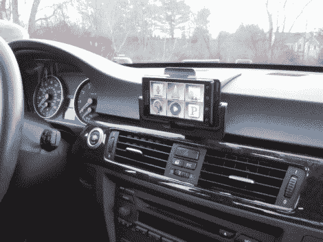

# 机器人数控铣削对接系统

> 原文：<https://hackaday.com/2011/02/04/cnc-milled-docking-system-for-droid/>

[Steve]想要一个 Droid 手机的坞站，但不忍心把看起来很廉价的零件放在他漂亮的宝马里。为了满足自己的功能和风格需求，他决定建造自己的。他的主要目标是有一个没有电线的坞站，但它也需要是可移动的，并且能够与不同的设备(GPS、Droid 等)一起工作。).

像这样的建造最困难的部分是将支架系统与汽车内部相匹配。[Steve]从专门为宝马 E90 系列制造的商用安装支架开始，避开了这个问题。从那里，他添加了他自己磨的安装支架的母半部分。公半部分使用边缘连接器连接到该部分，在汽车和当前安装的任何设备之间传递信号和电源。这样他可以为不同的设备设计支架，而不用改变车内的东西。

为了更近距离的观察，请在休息后观看视频。他提出的系统看起来很棒，而且运行良好。

 <https://www.youtube.com/embed/s1ndyB0uUmE?version=3&rel=1&showsearch=0&showinfo=1&iv_load_policy=1&fs=1&hl=en-US&autohide=2&wmode=transparent>

 </body> </html>