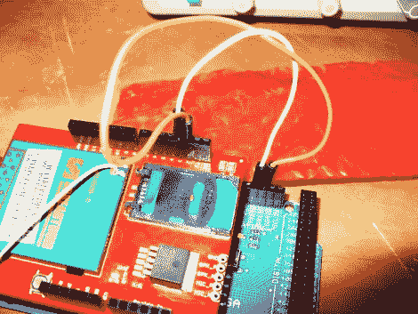

# 让您的 Arduino 项目走向蜂窝

> 原文：<https://hackaday.com/2011/02/05/going-cellular-with-your-arduino-projects/>

通过使用蜂窝连接，您可以大大增加项目的可扩展性。在设备可以获得服务的任何地方，你都可以与之互动。在过去，这是一个通过数据表让一切正常工作的非常艰难的过程，但是[本教程将展示与电话和短信交互的基础](http://tronixstuff.wordpress.com/2011/01/19/tutorial-arduino-and-gsm-cellular-part-one/)。这是正在成为庞大的 Arduino 系列的第 26 部，也是与 [SM5100B 蜂窝盾](http://www.littlebirdelectronics.com/products/Cellular-Shield-with-SM5100B.html)一起工作的第一部。

我们喜欢文章顶部的警告词，它提到你的草图中的一点坏代码可能会发出大量的短信，可能会让你损失一大笔钱。但是有大量的细节，如果你遵循每一步，我们认为你会非常自信地知道你在做什么。只要向我们保证你不会出去偷 SIM 卡给你的下一个项目使用。在这里找到[教程的第二部分](http://tronixstuff.wordpress.com/2011/01/31/tutorial-arduino-and-gsm-cellular-%E2%80%93-part-two/)，为以后的部分睁大眼睛。