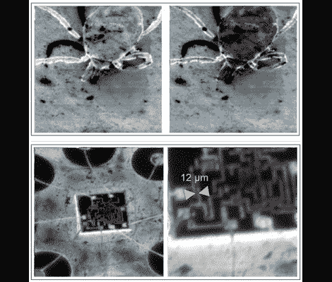

# 来自光导摄像管的 10 米扫描电子显微镜

> 原文：<https://hackaday.com/2011/02/06/10-%c2%b5m-scanning-electron-microscope-from-vidicon-tube/>

【Segelfam】[自己建造了扫描电子显微镜](http://www.coultersmithing.com/forums/viewtopic.php?f=10&t=172)。他的机器基于一个旧的[光导摄像管](http://en.wikipedia.org/wiki/Video_camera_tube#Vidicon)，这是一种视频记录技术，在 20 世纪 70 年代末伽利略探测器之前被用于美国宇航局的无人太空探测器。我们对【塞格法姆的】[原始建造日志](http://www.rapp-instruments.de/NewsPage/Vidikon/vidikon.htm)的[机器翻译](http://translate.google.com/translate?hl=en&sl=auto&tl=en&u=http://www.rapp-instruments.de/NewsPage/Vidikon/vidikon.htm)有些纠结，但似乎他在管中填充了氦气，以便将其转化为显微镜使用。但是不要担心，如果你对这个黑客感兴趣，信息都在那里——在论坛线程和构建日志之间——只是把它们放在一起以填充细节的问题。

如果你想知道，右上角的图片已经用 Photoshop 着色了；其余的直接来自 SEM。

[谢谢杰瑞]