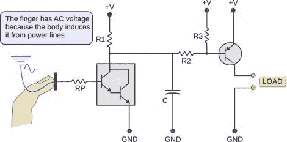

# 触摸传感器:概述、理论和构造

> 原文：<https://hackaday.com/2011/02/04/touch-sensors-overview-theory-and-construction/>

从周四开始，任何喜欢[简单触摸传感器帖子](http://hackaday.com/2011/02/03/34077/)的人都会对这些触摸传感器信息感兴趣。这是一个电阻式触摸传感器，详细介绍了交流嗡嗡声传感器，它根据你周围电力线的感应电流触发，以及电容触摸开关[，就像我们在过去的黑客攻击中看到的](http://hackaday.com/2009/09/28/capacitive-buttons-control-all-life/)。每个不同的概念都像上面的幻灯片一样进行了讨论和清晰的说明。[Giorgos Lazaridis]也将建造和展示赛道的个人帖子放在了一起。休息之后，我们嵌入了他的电阻传感器演示视频，并链接到所有三个示例电路。

电阻式触摸传感器视频:

 <https://www.youtube.com/embed/zNmN_iaJuN0?version=3&rel=1&showsearch=0&showinfo=1&iv_load_policy=1&fs=1&hl=en-US&autohide=2&wmode=transparent>

 <ul> <li><a href="http://pcbheaven.com/circuitpages/Resistance_Touch_Button" target="_blank">电阻式触摸传感器电路</a></li> <li><a href="http://pcbheaven.com/circuitpages/AC_Hum_Touch_Button" target="_blank">交流哼声电路</a></li> <li><a href="http://pcbheaven.com/circuitpages/PIC_Frequency_Change_Touch_Button" target="_blank">电容式触摸电路</a></li> </ul> 
[谢谢乔治和本]
 </body> </html>