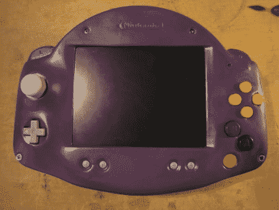

# N64 高级便携式游戏系统

> 原文：<https://hackaday.com/2011/02/05/n64-advance-portable-gaming-system/>

像许多人一样，[凯尔]喜欢任天堂 64，并决定他想要一个他心爱的控制台的便携式版本，这样他就可以在移动中玩游戏。一年后，两个 PSOne 屏幕，三个 N64 游戏机，他的愿景是完整的。一个 Game Boy Advance 旅行箱被掏空，用来放置游戏机，因此有了“N64 Advance”的绰号。像许多其他人一样，他的项目使用 PSOne 屏幕显示，并使用锂电池组提供长达 3.5 小时的播放时间。他通过在混音中添加一对 DS Lite 扬声器，确保在他的构建中包括任天堂家族的其他成员。

这个版本还包括一些不错的“额外功能”，如内置 N64 RAM 扩展包，耳机和 A/V 输出端口(带有电视用的屏幕关闭开关)，以及可以由第一个或第二个玩家使用的外部控制器端口。一定要看看他跳伞后的视频。

 <https://www.youtube.com/embed/uZfwA4dioB4?version=3&rel=1&showsearch=0&showinfo=1&iv_load_policy=1&fs=1&hl=en-US&autohide=2&wmode=transparent>

 </body> </html>