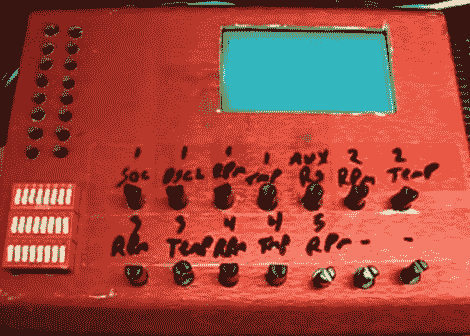

# 混合输入输出测试模块

> 原文：<https://hackaday.com/2011/02/08/mixed-io-testing-module/>

需要测试大量不同传感器的显示接口[Fileark]为自己建造了这个[模拟和数字输入/输出模拟器](http://filear.com/index.php/electronics/38-circuits/87-diy-io-simulator-ai-ao-do)。底部是两排调整模拟电压的微调按钮。每个电压由内部的 Arduino 测量，其值显示在图形 LCD 屏幕上，以确认您正在测试的硬件正在进行正确的测量。还有两种不同形式的数字 I/O。左上角是瞬时按钮，但下面的 DIP 开关组允许相同的连接切换开和关。这不是一个自动化的测试平台，但是如果你有很多 I/O，或者很多硬件要测试，这将节省你一些时间。

休息后不要错过演示视频。

 <https://www.youtube.com/embed/iv0LFknD1XA?version=3&rel=1&showsearch=0&showinfo=1&iv_load_policy=1&fs=1&hl=en-US&autohide=2&wmode=transparent>

 </body> </html>