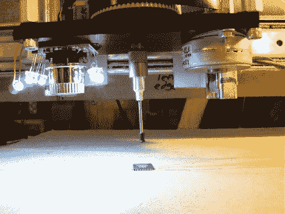

# 更新:开源取放

> 原文：<https://hackaday.com/2011/02/08/update-open-source-pick-and-place/>

[Tim]一直在忙着完成他的拾放式构建。我们在十月参观了[的第一版真空吸尘器头。从那以后，他抛弃了相机外壳，这样可以有更多的光线和更好的安装。尖端已经被一对真空镊子中的一个取代，整个东西现在安装在一台 diy 数控机器上。休息后的视频显示它拿起 IC 并在桌子上移动。看起来零件旋转特征非常准确。](http://hackaday.com/2010/10/01/open-source-pick-and-place/)

他提到他使用的 CNC 非常慢。我们希望他检查一下这个可打印的三角洲机器人。通常与取放机器一起使用的[硬件。](http://hackaday.com/2010/05/31/lego-pick-and-place/)

 <https://www.youtube.com/embed/Deq2ZG6usIs?version=3&rel=1&showsearch=0&showinfo=1&iv_load_policy=1&fs=1&hl=en-US&autohide=2&wmode=transparent>

 
【三角洲机器人通过<a href="http://blog.makezine.com/archive/2011/02/3d-printed-delta-bot.html" target="_blank">制造</a>
 
[谢谢
 </body> </html>