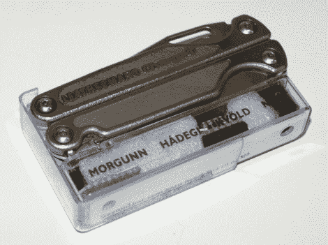

# 多工具报警系统

> 原文：<https://hackaday.com/2011/02/09/multitool-alarm-system/>

这里有一个方法可以确保你不会把你的 Leatherman 多功能工具忘在某个地方。这是一个报警系统，当工具从皮套中取出时会启动一个计时器。五分钟后，模块会发出嘟嘟声，提醒您将工具放回原处。烦人？有可能，但是如果你没有完成你的工作，只需按下模块上的~~簧片~~开关来重置计时器。PIC 12F683 处理时序并产生压电蜂鸣器的波形。也许这可以通过像 LM556 一样的双 [555 芯片](http://hackaday.com/2011/02/07/more-555-projects-to-enjoy/)来实现(一个计时器用于倒计时，另一个用于压电波形)，但 PIC 有省电模式，应该可以让纽扣电池持续很长时间。