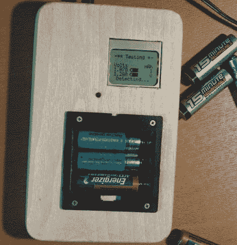

# 充电电池容量测试仪

> 原文：<https://hackaday.com/2011/02/10/rechargeable-battery-capacity-tester/>

如果你像大多数人一样，你可能有一堆混杂的充电电池，不知道它们能容纳什么样的电荷。你可以观察一个伏特计几个小时，同时耗尽每一个电池，注意它何时下降到其额定电压以下——但话说回来，你还有生命。与其在万用表前浪费时间，[BrianH]决定建造一个自动电池容量测试仪来替他完成这项工作。

他创建了一个简单的电路，可以消耗任何 AA 电池，NiMh 或 NiCd，并以毫安小时为单位记录其有效容量。由于所用的 ATMega168 微控制器板上有 6 个模拟/数字转换器，他认为还不如设计他的测试仪来同时测量三节电池的容量。[BrianH]将仪表连接到一个旧的诺基亚 LCD 上，然后将他的项目转移到一个完整的 ATMega 上，腾出他的 Arduino 来做其他任务。一旦他把东西重新组装好，他就把它们都装进一个漂亮的木箱里。

他的文章充满了细节和源代码，所以一定要去看看。我们有跳跃后充电器运行的视频。

[gigya src = "[http://www . meta cafe . com/FP layer/5929960/chargeable _ battery _ capacity _ tester . swf&# 8221](http://www.metacafe.com/fplayer/5929960/rechargeable_battery_capacity_tester.swf&#8221)；width = " 470 " height = " 345 " quality = " high " wmode = " transparent " allow full screen = " true " allowScriptAccess = " always "]