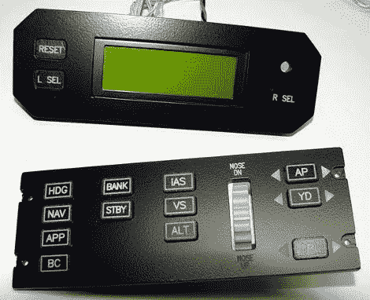

# 背光按钮和面板

> 原文：<https://hackaday.com/2011/02/10/backlit-buttons-and-panels/>

“踢轮胎和点火”是[Ruscool Electronics]的一个博客，专注于从头开始建造驾驶舱模拟器，虽然博客上有各种各样的漂亮信息，但读者[Brian]指出了一个条目，解释了如何用丙烯酸板和数控机床制作[背光控制面板。](http://kickthetyresandlightthefires.blogspot.com/2010/04/manufacturing-autopilot-system.html)

零件开始时是透明的丙烯酸树脂，切割成一定的形状和尺寸。下一步是厚厚的，但均匀的油漆涂层，所以面板是不透明的，然后将其放入数控机器进行雕刻。现在雕刻的是一片霜白色，为后面的发光二极管做好了准备。

最终的结果看起来很棒，很专业，但是，我们不得不考虑如何在没有 CNC 的情况下实现同样的外观。

想法？