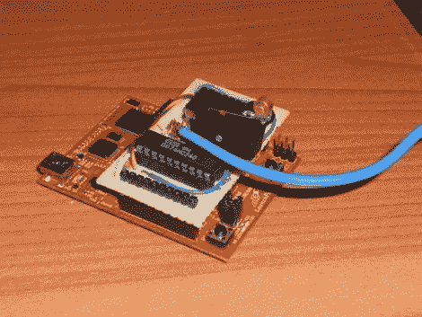

# 发射台串行莫尔斯电码发射机

> 原文：<https://hackaday.com/2011/02/11/launchpad-serial-morse-code-transmitter/>

德州仪器(Texas Instruments)的 LaunchPad dev 开发板价格便宜，易于编程，如果您不需要一些花里胡哨的东西，这是一个很好的 Arduino 替代产品。[ech0s]通过构建一个具有双操作模式的[莫尔斯电码发射器，很好地发挥了他的作用。发射机不仅能编码和发送输入终端客户的信息，还允许用户通过手动操作按键开关发送信息。受去年夏天我们展示的](http://www.instructables.com/id/LaunchPad-Serial-Morse-Transmitter)的[高空气球发射器的启发，该项目使用类似的组件进行信号放大和传输。文本可以在 Putty 终端窗口中输入，然后在传输前由 MCU 编码成莫尔斯码。目前，无线电传输的速度约为每分钟 15 WPM，相当快。尽管他的系统表现很好，但[ech0s]计划进行一些改进，包括建立适当的 PCB 以及一些软件调整，以提高缓冲和带宽。一定要检查他的视频发射机在行动后，跳转。](http://hackaday.com/2010/07/27/200-mile-rf-transmitter-and-high-altitude-balloon/)

 <https://www.youtube.com/embed/nori-RjHEEo?version=3&rel=1&showsearch=0&showinfo=1&iv_load_policy=1&fs=1&hl=en-US&autohide=2&wmode=transparent>

 </body> </html>