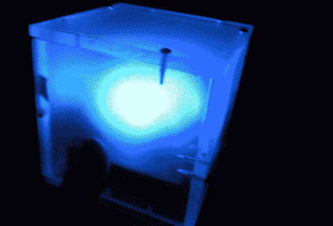

# RGB“倾斜立方体”

> 原文：<https://hackaday.com/2011/02/10/rgb-tilty-cube/>

本对微控制器的介绍是这个有趣的小礼物，他称之为“倾斜立方体”。这是一个装有 3 个发光二极管的丙烯酸盒子，根据你倾斜它的方式来改变颜色。听起来像一个有趣的玩具，也是一个很好的学习项目。[Ben]选择 PIC12F615 作为大脑，并在 perfboard 上展示。由于这是他第一次体验微控制器，他必须学习如何闪烁 led，然后计算 PWM 等。尽管这个项目没有完成时的视频，因为它是作为礼物赠送的，我们认为他已经很好地解决了这个问题。他确实表示，led 比他希望的要暗，并提供了一些关于他下次如何将整个项目做得更好的想法。