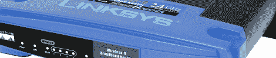

# 用什么开发板？(第二部分)

> 原文：<https://hackaday.com/2011/02/14/what-development-board-to-use-part-two/>

我们要求对我们上一篇开发板帖子做出回应，你们都照做了。我们收到了充满您意见的评论、论坛帖子和电子邮件。就像上次的一样，我们不可能覆盖每一块板，所以这里有一些看起来受欢迎的选择。请随时向我们发送您最喜欢的主板，我们可能会在以后推出它们！

**流行:**

***视差推进器:*** 我们听到了外面视差风扇最大的叫声。Propeller 是一个独特的芯片，因为它包含 8 个称为 cogs 的内核，每个内核轮流执行单独的代码。这种设计允许忽略中断式编程，而是为每个内核分配特定的任务。有许多可用的主板，包括[小工具强盗的平台](http://hackaday.com/2010/10/19/propeller-platform-prototyping-board-gets-an-upgrade/)以及来自[视差](http://www.parallax.com/Store/Microcontrollers/PropellerAccessories/tabid/786/ProductID/423/List/0/Default.aspx?SortField=ProductName,ProductName)的主板。考虑 8 个内核而不是一个内核可能会给一些嵌入式程序员带来一个学习曲线，尽管在线上有许多代码示例可以帮助初学者入门。

***基于 Atmel at 90 USB 和 AT32U4 的电路板:***Atmel at 90 USB 和 ATmega32U4 芯片在像 [Teensy/Teensy++](http://www.pjrc.com/teensy/) 这样的低器件数量电路板上很常见，因为它们内置了硬件 USB 支持，这意味着不需要 FTDI 或等效芯片。这些开发板往往成本较低，易于在试验板上实现，并且在 Teensy 等情况下，与 Arduino IDE [兼容](http://www.pjrc.com/teensy/teensyduino.html)。这些板所基于的芯片也是那些第一次尝试微控制器电路设计的人的绝佳选择，因为它们简单且硬件要求低。

***微芯片的 PIC 线:*** 不知何故，我们上次设法把整个微芯片人群冷落了。一组流行的微控制器，其市场细分与 Atmel 的芯片相似，这些芯片从低端和低成本的 8 位系列到高端的 16 位和 32 位型号不等。我们收到了[的](http://www.microchipdirect.com/productsearch.aspx?Keywords=DM164127)好的[号](http://www.mikroe.com/eng/products/view/318/pic32mx4-multimedia-board/#mmb_onboard)的的[开发](http://www.mikroe.com/)的[板的](http://www.sparkfun.com/products/9645)的[的](http://www.microchip.com/stellent/idcplg?IdcService=SS_GET_PAGE&nodeId=1406&dDocName=en538340)的推荐，价格、功能和易用性各不相同。我们将依靠评论和论坛帖子来帮助说服您尝试哪种特定的模式。

[编辑:根据大众要求添加了精选 3]

****权贵:****

 ****
**

***mbed:***mbed 可能是 ARM 的 Cortex-M3 芯片最受欢迎的爱好开发板之一，mbed 的尺寸与 Teensy 相似，但在功率上有了巨大的飞跃。mbed 包括许多外设的硬件，包括通过添加 RJ-45 端口支持以太网。mbed 与其他类似主板的主要区别在于完全基于 web 的 IDE。我们[之前已经审查过](http://hackaday.com/2009/11/21/review-mbed-nxp-lpc1768-microcontroller/)和 [mbed](http://en.wikipedia.org/wiki/Mbed_microcontroller) ，所以要了解更多细节，请务必查看。

*****瑞萨 RX62N RDK:*** 每当一家公司[免费赠送](http://hackaday.com/2010/11/14/renesas-rx-design-contest-110k-of-cash-and-prizes/)开发板时，社区往往会欣然接受。虽然不是普通的免费准系统板，但 RDK 有很多板上外设，包括一个以太网端口以及一个 3 轴加速度计。不幸的是，你再也不能免费得到一个了(至少在这次比赛中不能)，但是从我们从读者那里听到的所有信息来看，无论如何投资都是值得的。**

 **

LeafLabs 的 ***枫树:*** 枫树[枫树](http://hackaday.com/2010/05/24/maple-r3-now-shipping/)是 Arduino 等开放硬件工具对业余爱好者环境产生影响的一个很好的例子。以 ARM Cortex-M3 为特色，枫树有足够的处理能力，也可以吹嘘它与 Arduino 有相同的标题布局。这意味着几乎所有商业上可用的 Arduino shields 都可以在 Maple 上工作，这是任何投资了大量 Arduino 设置但需要注入性能的人的一个主要卖点。

**奖励积分:**

**
**

*****基于 OpenWRT 的路由器:*** 通常，项目需要通过有线或无线方式联网，以便根据需要运行。许多读者建议购买(或回收)大量低成本无线路由器中的任何一个，并在其上安装基于 linux 的定制固件，而不是购买内置以太网或 Wi-Fi 的高端开发板。这些电路板通常具有原本用于调试的 UARTs 或 USB 端口，可用于扩展传感器或其他低端微控制器。真正意义上的黑客，我们为这种创造力喝彩。一些受欢迎的固件包括 [DD-WRT](http://www.dd-wrt.com/site/index) 、 [OpenWRT](http://openwrt.org/) 和[番茄固件](http://www.polarcloud.com/tomato)。不过，在你购买任何东西之前，一定要确保你的设备支持。**

 **

***FPGA 板:*** 当我们着手开发开发板时，我们想到了微控制器。然而，就信号处理、定制高速逻辑或灵活性而言，FPGAs 是绝佳的选择。如今，业余爱好者的两个主要玩家是 Xilinx 和他们的[斯巴达](http://www.xilinx.com/onlinestore/s6_boards.htm)系列，以及 Altera 和他们的[旋风](http://www.altera.com/education/univ/materials/boards/de2/unv-de2-board.html)系列。两家公司都免费提供他们的 IDE**、**，选择哪种方式取决于个人偏好。两家公司还支持在 FPGA 上实现虚拟微控制器的 SoC 设计，这为任何爱好者或工程师增加了一层额外的灵活性。大多数发烧友可能不需要尖端 FPGAs(或 [CPLD](http://en.wikipedia.org/wiki/Complex_programmable_logic_device) s)的性能，所以请留意在售的旧开发板或第三方制作的开发板。

***自己搭建:*** 虽然这看起来像是对我们问题的一种“滚出我的草坪”的回答，但从头开始搭建开发板还是有很多可说的。如今，许多 8 位或 32 位微控制器只需要很少的外部元件就能以基本模式运行，并且可以与 JTAG 或 FTDI 电缆结合进行编程和通信。有无数关于使用 perf-board 或[蚀刻电路板](http://hackaday.com/2008/07/28/how-to-etch-a-single-sided-pcb/)制作定制电路的教程，这种经验对于在简单项目中脱离高成本开发板**来说是无价的。********