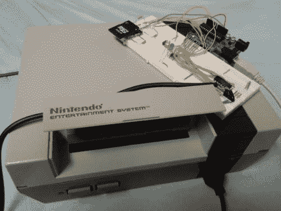

# NESBot 视频游戏自动化

> 原文：<https://hackaday.com/2011/02/11/nesbot-video-game-automation/>

如果你碰巧喜欢电子游戏，但实际上并不喜欢玩它们，男孩，我们有黑客给你！[pjgat09]向我们展示了如何用 Arduino 武装起来，你可以[强迫任天堂自己玩游戏](http://www.instructables.com/id/NESBot-Arduino-Powered-Robot-beating-Super-Mario-/)，就像一架老式的钢琴。该黑客涉及对 Arduino 进行编程，以接受“电影”中映射的命令，这些命令实际上是一组在玩游戏时执行的脚本按钮。这些类型的脚本可以从 [TASVideo](http://tasvideos.org/) 获得，这是一个专门从事视频游戏“工具辅助”速度运行的社区。这些影片通常与模拟器一起使用，因此需要进行一些调整才能使它们与控制台一起工作，因为按钮的按下被映射到屏幕上绘制的每一帧。虽然我们不确定这种技术有多有用，但这是一个相当新颖的概念。你可以看到跳跃后 5 分钟 SMB 速度跑的视频。

[https://www.youtube.com/embed/2JNf0lAo3Ns?version=3&rel=1&showsearch=0&showinfo=1&iv_load_policy=1&fs=1&hl=en-US&autohide=2&wmode=transparent](https://www.youtube.com/embed/2JNf0lAo3Ns?version=3&rel=1&showsearch=0&showinfo=1&iv_load_policy=1&fs=1&hl=en-US&autohide=2&wmode=transparent)