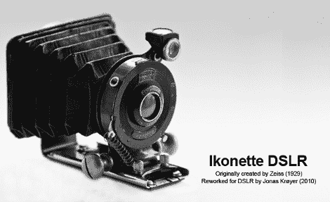

# 风箱照相机到 DSLR

> 原文：<https://hackaday.com/2011/02/11/bellows-camera-to-dslr/>

[乔纳斯·克罗伊]是一名数码摄影师，对旧相机非常着迷，将两者结合在一起[听起来是一个有趣的想法](http://www.jonaskroyer.com/photography/photoref/archives/1049)。他在网上四处搜索，爱上了[蔡司 Ikon Ikonette (1929-31)](http://elekm.net/pages/cameras/ikonette_vp.htm) 的设计，并找到了一个有缺口的镜头。

在完全拆卸相机后，发现他需要镜头/快门机构、风箱和允许镜头前后滑动的轨道。风箱被粘在相机的机身上，但是一些小心的撬动，它们很快就被安全的移除了。下一步是制作一个适配器，这样他就可以将镜头连接到数码 DSLR 相机上，一块钢板和一个从无名镜头上取下的尼康卡口将一切连接在一起。使用铆钉重新连接导轨，并将波纹管粘在板上。其他改进包括添加小的黄铜旋钮来帮助调整，以及圆珠笔上的弹簧来保持原来的快门打开。

据说这种新的旧镜头操作简单，能拍出一些漂亮的图像。虽然由于镜头没有任何现代涂层，但它也有缺点，比如图像中间的菱形光斑，如果你想要它，这可能是好的，如果你不想要，可以在 photoshop 中部分删除。