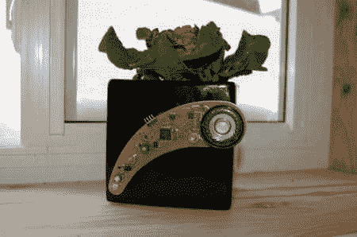

# 植物语者

> 原文：<https://hackaday.com/2011/02/11/the-plant-whisperer/>

[杰夫]充分认识到他没有能力让植物存活，他设计了一个系统来帮他一点忙。“[植物耳语者](http://www.instructables.com/id/The-Plant-Whisperer/)”监控水位，并通知他植物是否需要注意。实际上，不管怎样它都会通知他。植物耳语者使用实时文本到语音来说出几个预编程的事情中的一个，或者宣布它的快乐或者请求更多的水。他使用视差推进器来完成这项工作，因为他说它能够处理实时文本到语音的转换。我们意识到这有点夸张，但是我们绝对喜欢。我们想要的唯一改进是可能使用预先录制的声音，以便更加清晰。休息之后你可以看到一段视频。

 <https://www.youtube.com/embed/-x9-SPLeg2A?version=3&rel=1&showsearch=0&showinfo=1&iv_load_policy=1&fs=1&hl=en-US&autohide=2&wmode=transparent>

 </body> </html>