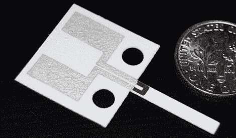

# 用于硬币的纸质加速度计正在研发中

> 原文：<https://hackaday.com/2011/02/12/paper-accelerometers-for-pennies-in-the-works/>

廉价纸质加速度计？先给我们记下一打。他们还没有为大规模生产做好准备，但是看起来他们已经在路上了。

乔治·怀特塞德斯(George white sides)带领一个团队开发了一种新技术，使用简单的制造方法来生产上面看到的传感器。石墨和银墨水被丝网印刷到厚纸上。从传感器主体伸出的单个肢体是一张单独的纸，当施加力时，它会弯曲碳区域。这改变了碳的电阻，该电阻是用一个[惠斯通电桥](http://en.wikipedia.org/wiki/Wheatstone_bridge)测量的，惠斯通电桥是通过将电阻粘在装置上而构成的。

与我们习惯的大多数加速度计模块相比，这听起来并不复杂，但如果你需要一个检测突然运动的传感器，这听起来就像是完美的一部分。现在谁想成为第一个在地下室复制这个的人？

[谢谢杨奇煜]