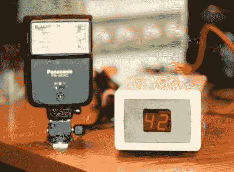

# 具有可编程延迟的闪光触发器

> 原文：<https://hackaday.com/2011/02/13/flash-trigger-with-programmable-delay/>

这里有一个可编程延迟的[闪光触发器](http://blog.blazingangles.net/soapbox/2011/02/programmable-millisecond-delay.html)。这些触发器通常用于捕捉像气球爆裂这样的快速事件。这项技术发生在一个黑暗的房间里，百叶窗是开着的。当事件被触发时，闪光灯照亮场景并捕捉图像。因为这些需要精确的计时，同步事件通常是一件麻烦的事情，因此像[使用压力板](http://hackaday.com/2010/08/11/snapping-pics-at-the-right-moment-with-a-pressure-plate/)这样的解决方案。

这个版本以 PICAXE 08M 为中心，允许摄影师使用任何他们想要的触发器，但增加了延迟。上面的方框显示了为 42 毫秒延迟设置的装置。因此，如果你用气球爆炸的声音作为触发器，你可以在事件真正开始之前不闪光。

[感谢两部分环氧树脂]