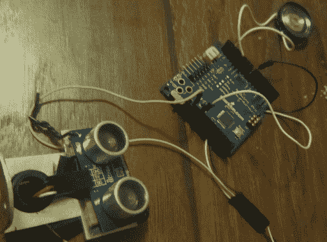

# 测距仪音乐玩具

> 原文：<https://hackaday.com/2011/02/13/range-finder-musical-toy/>

Instructables 用户[sketchsk3tch]想用家里的东西给他的孩子做一个有趣的玩具，于是[想到了 Ping 风琴](http://www.instructables.com/id/Ping-Organ)。风琴的演奏方式是站在视差范围传感器前，并随意移动。他将距离传感器与 Arduino 接口，从一个旧玩具中取出一个小扬声器用于音频输出。

该项目的代码相当简单，大部分代码都是从 Ping 和 Arduino 附带的演示软件中借用的。他做了一些小的调整，以便让风琴演奏实际音符的频率，以及在计算要演奏的特定音符时允许一些灵活性。

虽然这不是我们报道过的最复杂的项目，[sketchsk3tch]报道说他的孩子喜欢花时间在风琴前疯狂地挥舞，这正是他想要的。
休息后正在测试的器官的视频。

[https://www.youtube.com/embed/6F4xoe1rQMs?version=3&rel=1&showsearch=0&showinfo=1&iv_load_policy=1&fs=1&hl=en-US&autohide=2&wmode=transparent](https://www.youtube.com/embed/6F4xoe1rQMs?version=3&rel=1&showsearch=0&showinfo=1&iv_load_policy=1&fs=1&hl=en-US&autohide=2&wmode=transparent)