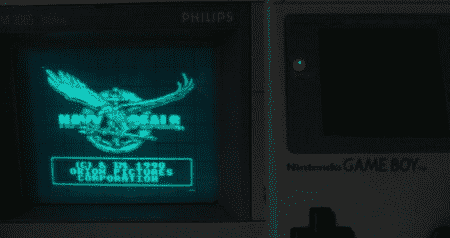

# 任天堂游戏机

> 原文：<https://hackaday.com/2011/02/14/nintendoscope/>

[Craig]将他的 gameboy hackery 带到了下一步，[使用示波器作为外部显示器](http://flashingleds.wordpress.com/2011/02/13/nintendoscope/)。早在 2010 年 11 月，[Craig]就向我们展示了如何[从经典游戏机的屏幕](http://hackaday.com/2010/11/10/diving-deep-into-the-game-boy-lcd-protocol/)中提取视频数据，有了这些信息和一个非常强大的 XMega128A1 控制器，处理这些数据并将其输出到 XY(z)模式的示波器上似乎很简单，特别是因为他已经为我们做了所有的艰苦工作。

具有 XY 模式的示波器通常在背面有一个 Z 输入，X 控制光束从左到右的位置，Y 控制光束从上到下的位置，Z 控制光束的强度。通过扫描 X 和 Y 作为线，Z 控制光束的阴影，可以很容易地将典型的矢量显示器重新用作类似于电视或计算机显示器的光栅显示器(只要你的数学和时间正确)，使示波器非常适合作为 gameboy 等设备的输出显示器，这些设备没有“标准”友好的显示系统。

休息之后，请加入我们，观看一段简短的视频，并查看[示波器终端、](http://hackaday.com/2010/02/24/oscilloscope-doubles-as-a-serial-terminal/)或[VGA-Sope 转换器](http://www.electronixandmore.com/project/13.html)，了解如何将示波器用作光栅显示器的更多示例。

 <https://www.youtube.com/embed/-7LzetRlZEg?version=3&rel=1&showsearch=0&showinfo=1&iv_load_policy=1&fs=1&hl=en-US&autohide=2&wmode=transparent>

 </body> </html>