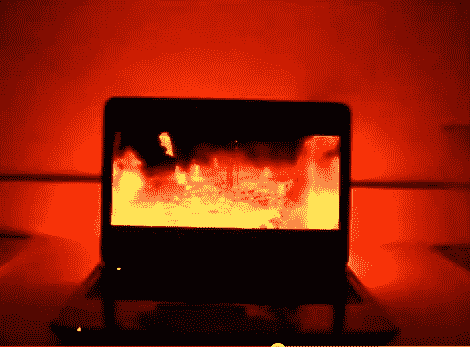

# 基于 Arduino 的电脑环境照明

> 原文：<https://hackaday.com/2011/02/14/arduino-based-pc-ambient-lighting/>

Arduino 论坛的[royboy]最近发布了一个帖子，展示了他的 [Arduino / PC 环境光系统](http://siliconrepublic.blogspot.com/2011/02/arduino-based-pc-ambient-lighting.html)。只要你的视频是从电脑上发送的，这个系统就很容易连接和使用，这对我们许多使用“家庭影院电脑”系统的人来说非常方便。使用 sparkfun 红/绿/蓝(不可寻址)led 灯条、ULN2003A、Arduino 和为处理项目而写的简短草图很容易组合在一起，也非常有效。

处理草图连续地获取屏幕截图，然后获取结果图片，并将所有颜色平均在一起。该平均颜色通过其标准串行连接向下馈送到 Arduino，并输出到 3 个支持 pwm 的输出端。这些输出连接到 2003 达林顿晶体管阵列，以切换 12 伏 led 灯条。

这看起来可能会很慢，因为处理是一种基于 Java 的解释语言，加上串行通信，加上 Arduino 开销，但它实际上响应非常快，几乎没有延迟就完成了任务。休息之后，请加入我们，观看一段快速视频。

 <https://www.youtube.com/embed/Am55k0k9eq8?version=3&rel=1&showsearch=0&showinfo=1&iv_load_policy=1&fs=1&hl=en-US&autohide=2&wmode=transparent>

 </body> </html>