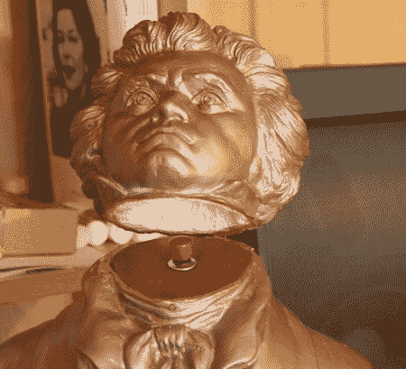

# 蝙蝠侠启发隐藏灯开关

> 原文：<https://hackaday.com/2011/02/14/batman-inspired-hidden-light-switch/>

[克里斯]新的爱好者送来了他的最新作品，[藏在雕像半身像里的无线电灯开关](http://www.thenewhobbyist.com/2011/02/wireless-light-switch-or-bust/)。在寻找另一个项目时，他发现了一个无线继电器，可以用来切换标准的 120 伏交流负载。他在没有计划的情况下买下了这个零件，但是灵感很快就来了。你们中的一些年轻人可能不记得最初的蝙蝠侠电视系列，但[克里斯]肯定记得。要进入蝙蝠洞，布鲁斯·韦恩必须打开一个位于他桌子上威廉·莎士比亚半身像内的秘密开关。虽然他没有一个秘密的门来激活，[克里斯]想不出任何更好的方法来打开他的男人洞穴的灯。他找到了一个看起来很像贝多芬的半身像，然后开始砍下他的头。

他制作了一个按钮的小底座，将电池供电的遥控器藏在下面，一个旧的 12v 壁式电源插座被重新用于驱动无线接收器。虽然不太复杂，但这绝对是一个有趣的项目，可以在孩子的房间里制作一个整洁的电灯开关。对更多受蝙蝠侠启发的黑客感兴趣吗？一定要看看几年前的这个蝙蝠洞式入口开关。

请继续阅读，观看他的隐藏灯开关的视频。

[https://www.youtube.com/embed/BFTzlHkIDGQ?version=3&rel=1&showsearch=0&showinfo=1&iv_load_policy=1&fs=1&hl=en-US&autohide=2&wmode=transparent](https://www.youtube.com/embed/BFTzlHkIDGQ?version=3&rel=1&showsearch=0&showinfo=1&iv_load_policy=1&fs=1&hl=en-US&autohide=2&wmode=transparent)