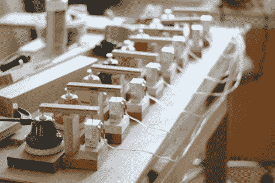

# 情人节情歌机

> 原文：<https://hackaday.com/2011/02/14/valentines-day-love-song-machine/>

正好赶上情人节，[亚当·迈耶]和 tellart.com 的朋友们一起做了一个小项目，他们称之为“[情歌机器](http://bells.tellart.com/)”。使用一个基于网络的表格，任何人都可以提交一首歌，这首歌将会在他们办公室安装的铃声系统上播放。你可以从几首预定义的情歌中选择，或者你可以创建自己独特的小夜曲编曲。一旦你准备好了，你的歌曲就会被排队，你可以在播放的时候观看你创作的视频。

该系统由 8 个螺线管驱动的铃铛组成，这些铃铛都由 Arduino 控制，它们已经连接到它们的网络服务器上。这是一个非常有趣的想法，肯定会有很多人提交歌曲，所以在事情变得太忙之前提交你的歌曲吧！

请继续阅读，观看他们系统运行的视频预览。

[https://player.vimeo.com/video/19854287](https://player.vimeo.com/video/19854287)