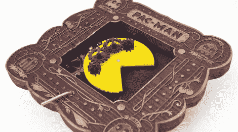

# Pactuator:机械 Pac-Man 框架

> 原文：<https://hackaday.com/2011/02/14/pactuator-mechanical-pac-man-frame/>

作为他长期进行中的工作“Pac-玛奇纳”(一个 Pac-Man 橱柜的电子机械再造)的概念证明，[Jonathan]需要一些方法来制作一个机械 Pac-Man，flappy jaw 和所有的东西。在经历了几个不同的设计可能性后，他决定采用一个有趣的装置，其中包括使用一个只有一半牙齿的齿轮来使嘴张开和闭合。不幸的是，纳木错·万代委婉地要求他不要将这些作为套件出售，但他很有帮助地包含了从头开始制作其中一个所需的所有东西。[乔纳森]甚至切割和激光蚀刻他自己的仿维多利亚时代的框架，以保持他的概念证明吃豆人准备好，直到需要的主要项目。