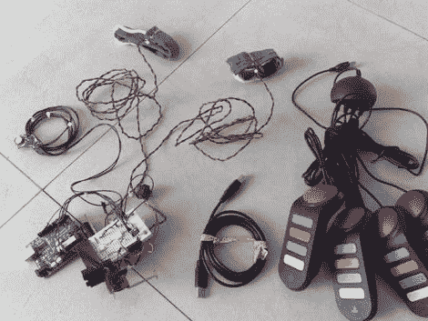

# 令人震惊的有趣的问答游戏

> 原文：<https://hackaday.com/2011/02/15/shockingly-fun-quiz-game/>

召集你的朋友在客厅玩面对面的智力竞赛游戏。这个没有你想象的那么好。答错一题，你就要去[接受 Venkman 治疗](http://www.youtube.com/watch?v=aB_lljnqkDw)，这要感谢一次性相机闪光灯电路中储存的电能。[Israel]从一台 Windows 机器上运行游戏问题，并使用一组四个 USB 操纵杆蜂鸣器，让每个参赛者响铃。他们都戴着一个装有电极的袖套，用于在回答错误时进行负强化。由于每个参赛者都要回答每个问题，所以用不了多久你就会从你的客人那里听到不舒服的失败的叫声。这似乎比[震惊人们没有平静他们的头脑](http://hackaday.com/2010/03/04/using-mindflex-to-shock-the-heck-out-of-people/)更公平一点，但是那个黑客的视频仍然是我们一直最喜欢的视频之一。