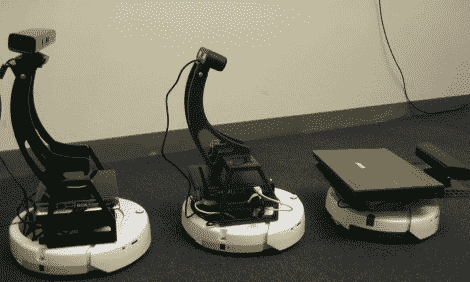

# 廉价的机器人平台结合了大量生产的零件

> 原文：<https://hackaday.com/2011/02/15/inexpensive-robot-platform-combines-mass-produced-parts/>

来认识一下 Bilibot，这是一个模块化机器人，旨在降低机器人修理工的入门成本。它结合了 Kinect、iRobot Create 和运行 ROS 的 Ubuntu box，使用了一些激光切割安装支架。这些都是相对便宜的元件，但最令人兴奋的是，已经有很多使用这种硬件的例子了。例如，我们在一月份看到了 [ROS 身体追踪](http://hackaday.com/2011/01/26/ros-gains-full-body-telemetry/)，它可以直接拔取并与这个硬件一起使用。你会认出这个底座是 iRobot create，上周在[视频聊天机器人中使用。操作的大脑来自三个 Linux 盒子的选择——两个无头的和一个笔记本电脑——它们已经预装了](http://hackaday.com/2011/02/09/low-cost-video-chat-robot/) [ROS](http://www.ros.org/wiki/) 。休息之后，在视频中观看开源 autonomy 作为 it 工具在办公室中的应用。

 <https://www.youtube.com/embed/xFVNrkd3JJU?version=3&rel=1&showsearch=0&showinfo=1&iv_load_policy=1&fs=1&hl=en-US&autohide=2&wmode=transparent>

 
[通过<a href="http://www.hizook.com/blog/2011/02/10/bilibot-project-low-cost-robot-platform-irobot-create-kinect-and-rosified-computer" target="_blank"> Hizook </a>感谢大卫]
 </body> </html>