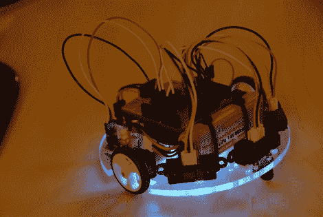

# 光轮，沿墙机器人

> 原文：<https://hackaday.com/2011/02/15/nimbus-the-wall-following-robot/>

[Johannes]发送了一个正在进行的项目的最新版本-[Nimbus，沿墙机器人](http://blag.pseudoberries.com/post/3253896466/based-on-my-earlier-prototypes-i-am-proud-to)。你可以通过阅读他的博客看到，这个机器人最初在纸板框架上操作，经历了[几次](http://blag.pseudoberries.com/post/1054749357/simple-cardboard-prototype-of-my-robot-the)的修改。Nimbus 最初是一个简单的 Arduino 驱动的机器人，但随着时间的推移，该项目进展顺利。最后一次修改只是避开墙壁，使用一个敏锐的红外接近传感器来检测，然后避开障碍物。最新的型号配备了一个漂亮的聚碳酸酯框架以及两个额外的红外接近传感器，使 Nimbus 能够很好地导航，轻松地跟随墙壁和避开障碍物。它确实会时不时地被地毯和电线缠住，但总的来说，Nimbus 是一个很棒的小机器人。[Johannes]甚至在机器人底部添加了一个小的 RGB 状态 LED，随时向操作员传达其导航状态。这是通过当物体被发现或移动到视线之外时闪烁各种颜色来实现的——这是一个非常新颖的附加功能。

继续阅读光轮导航的视频，不要忘记查看光轮照片流。

 <https://www.youtube.com/embed/WyHDMOdN6TY?version=3&rel=1&showsearch=0&showinfo=1&iv_load_policy=1&fs=1&hl=en-US&autohide=2&wmode=transparent>

 </body> </html>