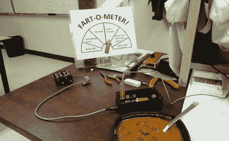

# arduino-屁量计

> 原文：<https://hackaday.com/2011/02/16/arduino-fart-o-meter/>

[机器人狂]用他最近的仪器向我们展示了现代技术的一些重要应用。该无线设备使用“perfboard Arduino”来读取远程有线甲烷传感器，并通过 nRF2401A 无线电收发器发送数据。

“数据”由另一个 Arduino /收发器组合接收，然后驱动连接到指针的伺服电机。仪表本身包含从“新鲜空气”到“液体”的 6 个量程，因此您的地位毋庸置疑。

无线和远程传感器设置使其成为一个简单的设备，可以放在您所爱的人的椅子上，同时让仪表保持足够的距离(以防您不得不逃跑)。如果你想要更精确的话，看看我们发布的屁的强度探测器，它增加了温度和声音，或者 T2 的椅子能让你的屁发出声音吗？

休息后加入我们的快速视频，这是一个真正的气体。

 <https://www.youtube.com/embed/Yv8-mPuJaQ0?version=3&rel=1&showsearch=0&showinfo=1&iv_load_policy=1&fs=1&hl=en-US&autohide=2&wmode=transparent>

 </body> </html>