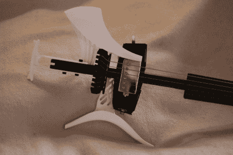

# 打印自己的吉他部件

> 原文：<https://hackaday.com/2011/02/16/printing-your-own-guitar-parts/>

组成这把吉他主体轮廓的白色部分已经被 3D 打印出来，以满足个人需求。他从去年开始[为他的 Zoybar 吉他设计部件](http://www.zoybar.net/group/parts)。这三个部分各有各的功能。尾部可用作落地脚架，也可用作倒挂乐器的挂钩。顶部的宽块为演奏者提供了放置前臂的地方，底部的块用作放置在腿上的支架，并包含用于吉他拾音器的插孔。休息过后，你可以在视频中看到他在演奏乐器。

我们寻找了更多关于 Zoybar 系统的信息，但是很难从那个网站上找到事实。我们知道，6 弦套件是不带品的标准配置，价格大约在 700 美元左右。但是如果它作为一种高质量的乐器，价格也不会太离谱。