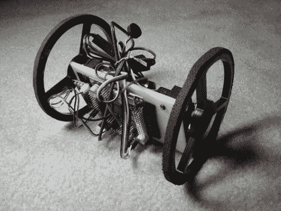

# 声控滚动机器人

> 原文：<https://hackaday.com/2011/02/16/voice-controlled-rolling-robot/>

[societyofrobots]最近发布了一份说明书，介绍如何在几个小时内建造一个声控机器人。这个机器人并不特别便宜，重约 230 美元，但如果你有办法，这是一个有趣的项目。机器人由一对伺服系统驱动，从 Axon II 微控制器获取它们的方向。VRbot 语音识别模块用于监听命令，使用户能够记录多达 32 个自定义触发器来指挥机器人。

包括机器人的所有源代码，以及如何开始编程微控制器的说明。代码提供了一些基本的功能，但使用功能强大的板载 ATmega460 可能还能做更多的事情。虽然这个机器人将成为一个很好的初学者/中级项目，但应该注意的是，[societyofrobots]制造和销售 Axon II，所以这个指导一半是指导一半是自我推销。你们中有人用过 Axon II 吗？让我们知道你的想法。

请继续阅读，观看构建过程和机器人工作的视频。

谢谢，[比尔·波特]。

 <https://www.youtube.com/embed/aUkLd2MncHg?version=3&rel=1&showsearch=0&showinfo=1&iv_load_policy=1&fs=1&hl=en-US&autohide=2&wmode=transparent>

 </body> </html>