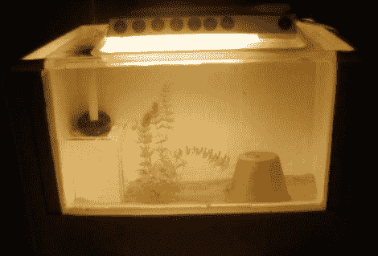

# 垃圾场鱼缸

> 原文：<https://hackaday.com/2011/02/16/junkyard-fish-tank/>

所以你的房子看起来像无用垃圾的垃圾场？是的，我们知道这是黑客的诅咒…你就是不能停止抢救东西。但是跟随[ponta zy 69]的领导，从垃圾中制造一些有用的东西。他把一个旧的聚苯乙烯盒子做成这个鱼缸。你可以看到盒子的侧面和背面没有改变，但是前壁不见了。[Pontazy69]标记并切割直线，同时在边缘周围留下唇缘。硅树脂被用来粘合一些丙烯酸树脂(或者玻璃？)到这个唇的内侧。干燥后，他又在外面加了一个珠子，以确保它不会漏。没有某种类型的过滤器，很少有鱼会喜欢这里，所以他用一个旧塑料瓶和其他一些东西做了一个。休息后，观看视频，向您展示如何构建水箱和过滤器。

我们喜欢水族馆黑客几乎和喜欢时钟黑客一样多。因此，检查一下[水交换系统](http://hackaday.com/2011/01/17/aquarium-water-exchanger/)，以及几个[不同的](http://hackaday.com/2010/02/26/cooling-leds-by-heating-the-water-saves-on-electricity/)照明[系统](http://hackaday.com/2010/01/29/salty-leds/)。然后记录你自己的水族馆项目并[让我们知道它们](http://hackaday.com/contact-hack-a-day/)。

聚苯乙烯鱼缸

 <https://www.youtube.com/embed/ac3SVHpuPhw?version=3&rel=1&showsearch=0&showinfo=1&iv_load_policy=1&fs=1&hl=en-US&autohide=2&wmode=transparent>

 
塑料瓶鱼缸过滤器
 <iframe class="youtube-player" width="800" height="480" src="https://www.youtube.com/embed/9h02dIBLVQ8?version=3&amp;rel=1&amp;showsearch=0&amp;showinfo=1&amp;iv_load_policy=1&amp;fs=1&amp;hl=en-US&amp;autohide=2&amp;wmode=transparent" allowfullscreen="true" style="border:0;" sandbox="allow-scripts allow-same-origin allow-popups allow-presentation"/> 
[谢谢格雷格]
 </body> </html>