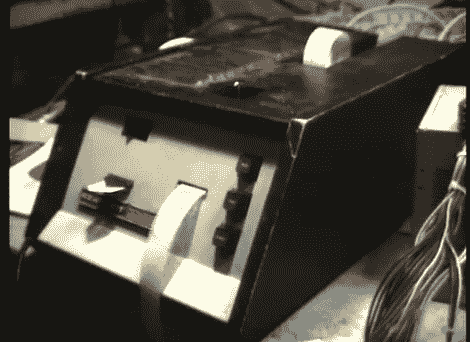

# 穿孔带音乐合成器

> 原文：<https://hackaday.com/2011/02/16/punch-tape-musical-synth/>

[Jeri Ellsworth]发来了一份 555 设计竞赛参赛作品，她觉得特别有趣。Synthanola 是一个三声道音乐合成器，接受来自一个旧的希斯基特纸带阅读器的输入。虽然这个黑客看起来过于复古，但它实际上是对技术的一种极其恰当的使用，因为希斯基特 H-10 和 555 定时器都是 70 年代流行的技术。这个复古的合成器使用了 14 个 555 定时器，其中 12 个专用于合成音频。如果这个条目没有赢得比赛，它肯定是大多数 555 定时器的有力竞争者。

[刷希巴]详细解释了用于驱动穿孔带音乐回放的逻辑，以及他的参赛作品的完整电路图。到目前为止，他已经把巴赫的发明和 D 小调赋格的 MP3 编码到了磁带上，希望以后还会有更多。为了真正欣赏他的努力，Synthanola 应该被看到以及听到。请留下来观看 synth 的两个视频。

如果你有兴趣看到更多的 555 个参赛作品，一定要看看我们的一些[前](http://hackaday.com/2011/02/15/screamer-doll-prank-toy/) [特色](http://hackaday.com/2011/02/07/more-555-projects-to-enjoy/) [项目](http://hackaday.com/2011/01/27/555-based-balancing-bot/)。

[https://www.youtube.com/embed/FyiECb2k7d8?version=3&rel=1&showsearch=0&showinfo=1&iv_load_policy=1&fs=1&hl=en-US&autohide=2&wmode=transparent](https://www.youtube.com/embed/FyiECb2k7d8?version=3&rel=1&showsearch=0&showinfo=1&iv_load_policy=1&fs=1&hl=en-US&autohide=2&wmode=transparent) [https://www.youtube.com/embed/eFlL5bFzc_A?version=3&rel=1&showsearch=0&showinfo=1&iv_load_policy=1&fs=1&hl=en-US&autohide=2&wmode=transparent](https://www.youtube.com/embed/eFlL5bFzc_A?version=3&rel=1&showsearch=0&showinfo=1&iv_load_policy=1&fs=1&hl=en-US&autohide=2&wmode=transparent)