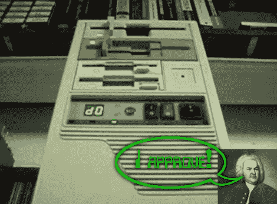

# 古典音乐在硬件最大失败上的最大成功

> 原文：<https://hackaday.com/2011/02/17/classicals-creates-hits-on-hardwares-greatest-flops/>

我们得到了很多关于旧硬件播放可识别音乐的提示。但偶尔这些项目中的一个会超越其他项目，这是伟大的硬件音乐的光辉典范。[funtothead]制作了一个音乐视频(插播在广告之后),展示了他的定制 MIDI 设备演奏巴赫的 d 小调托卡塔。他留下了一些评论，提示我们他做这件事的方法。最明显的是，他使用四个软驱中的步进电机来产生精确的音调。在内部，PIC 18F14K50 充当 USB 上的 MIDI 设备，接收所有 128 个 MIDI 音符的命令以及与之相关的弯音。前四个通道直接在每个驱动器上播放，其他十二个通道由微处理器在硬件之间分配。但是对于视频中听到的结果，你需要手工编码你的 MIDI 文件。

视频编辑为幻影在视频中软绵绵的样子加分…笑起来真好！

 <https://www.youtube.com/embed/dmoDLyiQYKw?version=3&rel=1&showsearch=0&showinfo=1&iv_load_policy=1&fs=1&hl=en-US&autohide=2&wmode=transparent>

 
[谢谢
 </body> </html>