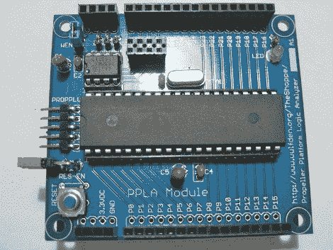

# 螺旋桨平台逻辑分析器

> 原文：<https://hackaday.com/2011/02/17/propeller-platform-logic-analzyer/>

[伍尔夫登的]新玩意是一个 [28 通道 3.3 伏数字逻辑分析仪](http://www.wulfden.org/TheShoppe/prop/ppla/index.shtml)。由一个以 100MHz 运行的视差推进器提供动力(允许 10 纳秒的采样率)，使用所有通孔部件，开放式设计，这样就有可能制作自己的产品。

数据被收集并发送到运行[pro analyzer](http://forums.parallax.com/showthread.php?110762-Propalyzer-Distribution-New-Update-1.0.1.4-Available)的主机，它看起来是一个非常好的逻辑分析仪前端，拥有所有需要的功能和惠普启发的设计。该板的设计允许您将其插入任何螺旋桨平台板，这对于那些有其他螺旋桨板的人来说非常方便，尽管其他人将不得不使用稳压 3.3 伏电源和串行转换器。

总的来说，这看起来是一个非常方便的工具，无论你选择在你的 Propeller 平台上使用还是自己开发，如果你需要一个逻辑分析仪，其功能和成本都非常有吸引力。

休息之后，请加入我们，观看由[Nick](Gadget Gangster)制作的快速介绍视频

<https://player.vimeo.com/video/19542703>

 </body> </html>