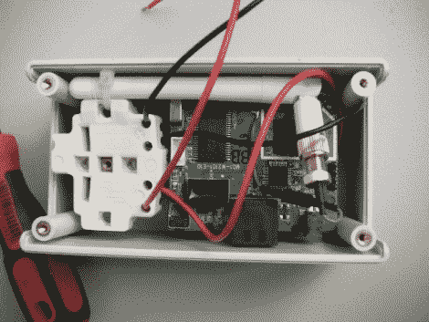

# 插件模块谎报咖啡店的新闻。真的还是假的？

> 原文：<https://hackaday.com/2011/02/19/plug-in-module-lies-about-news-at-coffee-shops-real-or-fake/>

[Mike]发送了一条关于 Newstweek 的提示，我们正在转向我们的读者来告诉我们这是真的还是我们被骗了。[他发给我们的链接](http://newstweek.com/2011-01-07-device-distorts-news-on-wireless-neworks)指向一篇写得很好的新闻式文章，内容是关于一种设备，它插入一个开放的 WiFi 热点附近的墙上，对连接到接入点的设备进行某种中间人攻击。这篇文章描述了上面观察到的设备，然后欺骗无线网络的 ARP 表，以便在您正在阅读的页面中插入虚假的新闻故事。显然，一旦启动，这个小盒子就会通过 TOR 连接向其制造商发出指令。

这个盒子让我们想起了 Sheevaplug，所以不是硬件让我们质疑这个设备的可能性。但是看看 Linux 终端屏幕读数。它会显示一个包含“newstweek”字样的提示。这是文章所在网站的地址，给我们一种强烈的被欺骗的感觉。

你觉得呢，真的假的？请在评论中告诉我们(以及你为什么这么想)。