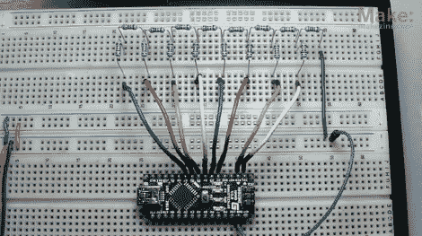

# 你的第一个数模转换器

> 原文：<https://hackaday.com/2011/02/17/your-first-digital-to-analog-converter-build/>

你以前做过数模转换器吗？这是一个电路，可以从几个数字逻辑引脚获得 0 或 5V 电压，将它们组合在一起，并产生一个代表该值的模拟电压。如果你从未做过，这是你的机会。Make 的[Collin Cunningham]整理了另一个关于 DAC 的[实验室视频](http://blog.makezine.com/archive/2011/02/dac.html),我们在广告之后嵌入了该视频。

上面的电路使用一个 R-2R 电阻网络——通常称为电阻阶梯——你可以从[Collin]链接到的参考页了解更多信息。虽然 IC 封装中的 DAC 是目前最常见的应用，但我们确实不时在音频黑客中看到这些 [R-2R 网络。](http://hackaday.com/2010/08/17/building-a-discrete-digital-analog-converter/)

[https://www.youtube.com/embed/b-vUg7h0lpE?version=3&rel=1&showsearch=0&showinfo=1&iv_load_policy=1&fs=1&hl=en-US&autohide=2&wmode=transparent](https://www.youtube.com/embed/b-vUg7h0lpE?version=3&rel=1&showsearch=0&showinfo=1&iv_load_policy=1&fs=1&hl=en-US&autohide=2&wmode=transparent)