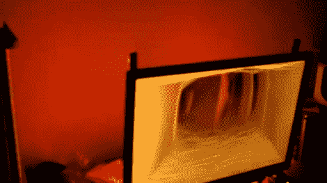

# 更多环境照明监控器黑客

> 原文：<https://hackaday.com/2011/02/17/more-ambient-lighting-monitor-hacks/>

[Christian Pigeon]的第一个大项目是为他的电脑显示器建造这个[环境照明系统。这是基于与 Phillips Ambilight 系统相同的概念，该系统照亮电视后面的区域，以匹配屏幕边缘的颜色。](http://electricnest.blogspot.com/2010/11/amblone-rgb-lighting-system.html)[我们在](http://hackaday.com/2009/12/23/atmolight-clone-of-an-ambilight-clone/)之前已经看过克隆人，但这是我们第一次遇到基于安布罗恩的[。](http://amblone.com/)

以 Amblone 为起点,[Christian]修改了代码，使其与 Arduino Duemilanove 一起工作，Arduino Duemilanove 的 PWM 通道比它的兄弟 Arduino Mega 少。没有人知道他从哪里获得了提供照明的 RGB LED 灯条，但驱动板只是一组电阻器和晶体管的原型板，用于开关二极管。休息后看看视频，看看他用这个设置达到的效果。

[https://www.youtube.com/embed/GubwmI5KR64?version=3&rel=1&showsearch=0&showinfo=1&iv_load_policy=1&fs=1&hl=en-US&autohide=2&wmode=transparent](https://www.youtube.com/embed/GubwmI5KR64?version=3&rel=1&showsearch=0&showinfo=1&iv_load_policy=1&fs=1&hl=en-US&autohide=2&wmode=transparent)