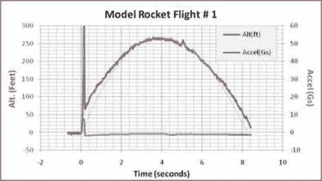

# 模型火箭无线电遥测

> 原文：<https://hackaday.com/2011/02/17/model-rocket-radio-telemetry/>

[Ken]发给我们他的指令，其中他使用无线电遥测技术通过一系列发射来监控他的空气动力模型火箭的状态。他的设置以 Arduino IDE 兼容板为中心，该板看起来约为 Boarduino 的大小，但具有嵌入式 915 MHz 无线电模块的优势。他使用的供应商也出售一些他用于飞行记录的附加模块，包括一个气压监视器和一个三轴加速度计。在飞行过程中，火箭不断向基站发送数据，前提是它保持在无线电工作范围内。

在最初的测试中，[Ken]发射了四次火箭，获得了其中一半的可用数据。他发现了一些关于他的模型火箭的有趣的事情，包括它创造了 60 Gs 的最大发射力。他计划在未来修改他的设置，比如减轻电池负载，以及增加一个高 G 模拟传感器来记录起飞时的力。这个套件，或者一个价格更合理的克隆品，将会成为任何火箭迷的一个巨大的补充。