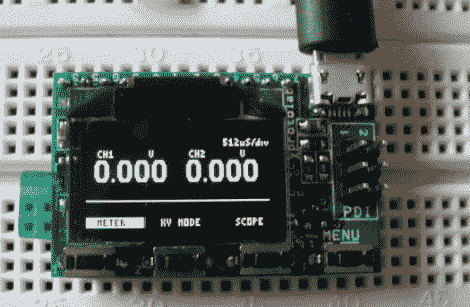

# Xprotolab:示波器和 Xmega 开发板

> 原文：<https://hackaday.com/2011/02/17/xprotolab-oscilloscope-and-xmega-development-board/>

这里有一个关于 Xprotolab 的很好的[动手概述，这是一个基于 AVR](http://tronixstuff.wordpress.com/2011/02/13/the-worlds-smallest-oscilloscope/) [ATxmega32A4](http://www.atmel.com/dyn/products/product_card.asp?part_id=4308) 微控制器的开发板。[微型 DIP 封装](http://gabotronics.com/development-boards/xmega-xprotolab.htm)包括一个有机发光二极管显示屏，四个触摸开关，可以通过微型 USB 连接器供电。这款设备出厂时可以用作双通道示波器，但休息后看看它在视频中有多小，以决定它是否真的对你有用。这并不是说它没有很多功能，事实上它充满了这些功能，但对于有意义的工作来说，这个屏幕相当小。尽管如此，35 美元的价格仍然是你接触硬件和熟悉这一系列微处理器的便宜方式。并不是说为了刷新新固件，你需要一个有 PDI 能力的程序员。

 <https://www.youtube.com/embed/Q22tB7C-bMg?version=3&rel=1&showsearch=0&showinfo=1&iv_load_policy=1&fs=1&hl=en-US&autohide=2&wmode=transparent>

 
[谢谢丹尼尔]
 </body> </html>