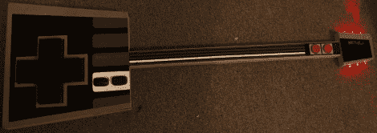

# NES·保罗游戏控制器

> 原文：<https://hackaday.com/2011/02/18/nes-paul-game-controller/>

[NeoTechni]来信分享她制作的新游戏外设，被称为 NES 保罗。该项目的最终目标是为她正在开发的一款游戏制作一个 NES 风格的控制器，该游戏暂定名为 8 位英雄。这把吉他主要是由木头以及她在房子周围捡来的一些东西制成的。一个 Xbox 360 控制器被拆除并连接起来，为吉他的按钮和 D-Pad 提供输入。甚至 Xbox 控制器的隆隆声包也被用来通过吉他床头上的 LED 调音栓提供错过音符的视觉反馈。

这篇文章被分成了几个部分，因为它被放在了一些谷歌 Buzz 帖子中，但它仍然相对容易理解。一旦游戏部分完成，我们迫不及待地想看看这个项目是如何完成的。