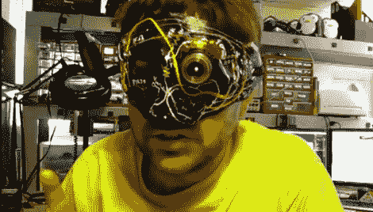

# 半机械人照相机面具

> 原文：<https://hackaday.com/2011/02/18/cyborg-camera-mask/>

[Ryan]发明了这个机器人化妆舞会面具戴在他妻子的艺术开幕式/化妆舞会上，它相当狂野。这个面具的突出特点是一个典型的点 n 拍摄式相机的镜头组件，它仍然连接到它的电子设备，所以它可以通过它的关闭和自检功能。你看不透它，但通过移动部件和内部的红色 LED，它确实创造了一个可怕的电子人类型的外观，

镜头组件的移动由面罩鼻梁架内的热敏电阻触发，在给定的时间内呼出的热空气会改变电阻，并由微控制器监控，微控制器的作用类似于拨动式开关。

虽然没有建立日志，零件清单，或许多细节，原理图提供给你看，如果你想尝试，使自己的。