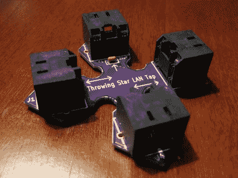

# 用投掷星嗅探以太网

> 原文：<https://hackaday.com/2011/02/18/sniff-ethernet-with-a-throwing-star/>

[Michael Ossmann]想出了一个漂亮的小装置，它将 RJ45 插头排列成加号形状，用于嗅探以太网数据包，并将其命名为“投掷星形 LAN Tap”。虽然最初的设计工作良好，但它确实受到一些限制，如限于 10/100 基本网络和单向。这个新版本的“[投掷之星 LAN Tap](http://ossmann.blogspot.com/2011/02/throwing-star-lan-tap.html) ”修复了这些问题，并增加了一些急需的便利。

需要耦合器且容易损坏的公插头、有利于星形 pcb 的精细拼接以及母插座都不见了。支持 1000 base 网络，但由于 1000 base 的工作方式和希望保持设备无源，添加了电容器来过滤信号，并迫使网络下降到 100 base。当然，这可能是一个丑陋的黑客，但它是一个适合你口袋的丑陋黑客。