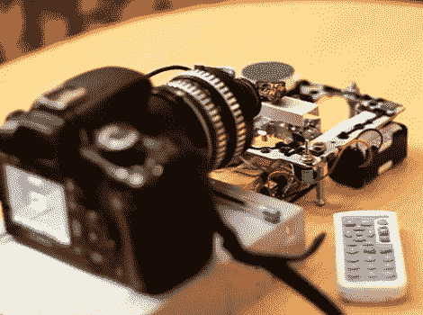

# 可堆叠的微距摄影设备

> 原文：<https://hackaday.com/2011/02/19/stackable-macro-photography-rig/>

拍摄微距照片时，由于景深减小，你会失去很多清晰度。获得清晰照片的一种方法是在距离拍摄对象稍有不同的距离拍摄多张照片，然后将它们堆叠成一张图像。有软件可以帮你做到这一点，但你仍然需要一套图片来开始。[Dsvilko]建立这个设置是为了[轻松捕捉一组微距图像](http://www.picaxeforum.co.uk/showthread.php?t=17248)。

他用光驱的内部零件作为雪橇来运送目标。PICAXE 驱动移动托架的步进电机，该电机从 IR 遥控器接收输入。这被证明是一个奇妙的方法，因为雪橇可以以 0.2 毫米的增量移动。在他得到他的一组图像后，他使用 [Zerene](http://www.zerenesystems.com/stacker/) 将它们堆叠在一起。

奖金指向[Dsvilko],他使用 Linux 命令行工具一起编辑了休息后嵌入的演示视频。

[https://www.youtube.com/embed/XeXjpZpaZns?version=3&rel=1&showsearch=0&showinfo=1&iv_load_policy=1&fs=1&hl=en-US&autohide=2&wmode=transparent](https://www.youtube.com/embed/XeXjpZpaZns?version=3&rel=1&showsearch=0&showinfo=1&iv_load_policy=1&fs=1&hl=en-US&autohide=2&wmode=transparent)

[谢谢两个部分]