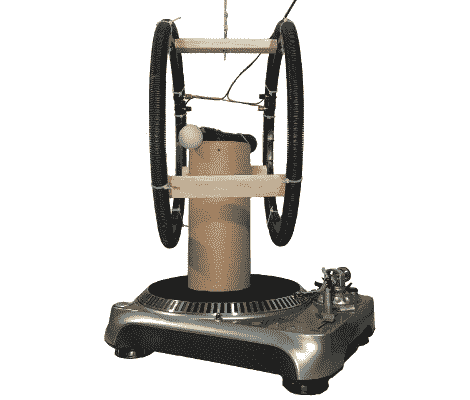

# 用 PlayStation Move 测量地球自转

> 原文：<https://hackaday.com/2011/02/19/measure-earths-rotation-with-playstation-move/>

这个看起来有些奇怪的[仪器被用来测量地球的自转](http://www.pabr.org/copernitron/copernitron.en.html)。该系统的核心是 PlayStation Move 控制器，使用它是因为它的双轴陀螺仪与 Wii Motion Plus 等其他可用产品相比具有最高的动态范围。它坐落在一个电唱机顶上的柱子上，选择电唱机是因为它的精确旋转速度。控制器两侧的两个环组成了一个[亥姆霍兹线圈](http://en.wikipedia.org/wiki/Helmholtz_coils)，用于抵消地球磁场，该磁场被发现会干扰 Move 控制器进行的测量。通过记录一段时间内的数据，实验者可以证明地球确实在旋转，也可以确定经度数据并找到真正的北方。休息之后，请观看数据打包视频。

 <https://www.youtube.com/embed/zkYWRgQmBKE?version=3&rel=1&showsearch=0&showinfo=1&iv_load_policy=1&fs=1&hl=en-US&autohide=2&wmode=transparent>

 </body> </html>