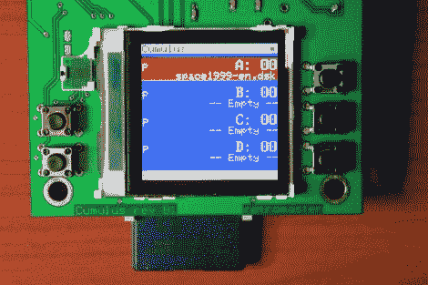

# 模拟 Oric-1 软盘硬件

> 原文：<https://hackaday.com/2011/02/19/emulating-oric-1-floppy-disk-hardware/>

这个设备被称为[积云，它被用来模拟](http://retromaster.wordpress.com/cumulus/) [Oric-1 和 Oric Atmos](http://en.wikipedia.org/wiki/Oric#Oric-1) 计算机的软盘硬件。这些 20 世纪 80 年代的计算机包括一个扩展槽，你可以连接一个软驱。这个模块被称为微盘系统，它还包括驱动电路，这意味着你不能仅仅用现代的软盘驱动器作为替代品。[Retromaster]通过构建模拟原始模块的 SD 卡接口，避开了对磁介质的需求。通过使用彩色屏幕和干净的电路板布局，我们可以看出这个项目投入了大量的爱。CPLD 实现微盘系统使用的通信协议，并创建在原始硬件上可以找到的所有寄存器。PIC 负责 SD 卡通信和用户界面。

除了[安慰的声音](http://hackaday.com/2011/02/17/classicals-creates-hits-on-hardwares-greatest-flops/)，我们敢打赌很少有人对使用软盘有美好的回忆。难怪我们最近经常看到[的黑客取代它们](http://hackaday.com/2010/12/06/knitting-machine-hack-by-keypad-emulation/)。