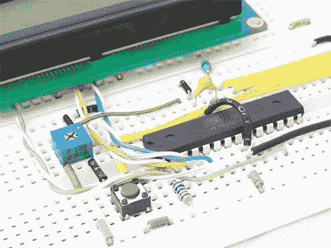

# 模数转换器构建

> 原文：<https://hackaday.com/2011/02/20/analog-to-digital-converter-build/>

[丹尼尔·加西亚]发给我们一个他整理的快速教程,演示如何使用 ATmega168 进行模数转换。对于那些在阅读了几天前[我们的帖子](http://hackaday.com/2011/02/17/your-first-digital-to-analog-converter-build/)后决定构建自己的数模转换器的人来说，这个及时的教程将是一个很好的免费项目。

ATmega168 有 6 个引脚，通常用于数字 I/O，但也可用于模拟输入。在他的例子中，他使用 trimpot 作为模拟输入设备，将其连接到上述模拟引脚之一。它的值以 16 位数字的形式返回，然后显示在连接的 LCD 上。本项目中使用的 LCD 显示器和试验板布局在他以前的文章中有所涉及，所以在阅读本教程之前，请务必通读这些内容。