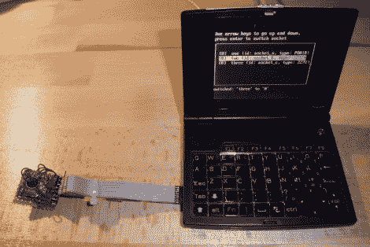

# 几乎可以从任何设备进行射频控制

> 原文：<https://hackaday.com/2011/02/20/rf-control-from-just-about-any-device/>

[Mirko]正在开发一个库，它将允许你对任何设备添加射频控制。唯一的要求是设备能够运行 Linux 内核，并且有几个 GPIO 管脚可用。一个相当直接的例子是，[一个 Netgear 路由器](http://nanl.de/blog/2011/01/rfm12-under-linux-and-remote-controlled-power-sockets/)。许多(如果不是大多数的话)路由器本身运行 Linux 内核，并且大多数路由器在板上有用于未使用的 IO 引脚的焊点，因此插入硬件非常简单。不太明显但更令人印象深刻的是上图中的黑客攻击。[米尔科]制造了[一条 SD 卡适配电缆，并使用读卡器中的触点](http://nanl.de/blog/2011/02/ben-nanonote-able-to-control-radio-power-sockets/)对四线 SPI 进行 bit bang，以与该射频模块进行通信。