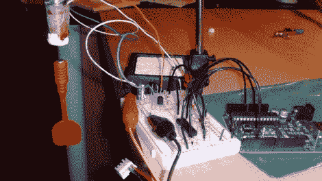

# Arduino 悬浮

> 原文：<https://hackaday.com/2011/02/21/arduino-levitation/>

这证明了 Arduino 是一个严肃的原型工具，而不仅仅是一个玩具。[Norbert Poár]建造了一个磁悬浮装置[，它将 Arduino 与电磁驱动电路和磁场感应电路结合在一起。与其他使用光学传感的](http://mekonik.wordpress.com/2009/03/17/arduino-magnet-levitation/)[悬浮装置](http://hackaday.com/2010/08/31/build-your-own-magnetic-levitator/)不同，这种实施方式使用电磁体上的霍尔效应传感器来保持电磁体和悬浮在半空中的永磁体之间的距离。休息后看看嵌入的视频，浏览[的概览页面](http://mekonik.wordpress.com/2009/03/02/my-first-arduino-project/)，看看去掉浮动对象周围的框架是多么令人愉快。这让我们想知道它是否可以以类似于磁性标尺的方式反转。

 <https://www.youtube.com/embed/QunBD_fD04k?version=3&rel=1&showsearch=0&showinfo=1&iv_load_policy=1&fs=1&hl=en-US&autohide=2&wmode=transparent>

 
[via <a href="http://dangerousprototypes.com/2011/02/15/arduino-magnetic-levitation-project/" target="_blank">危险原型</a>
 </body> </html>