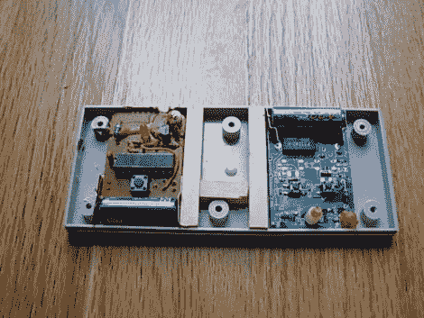

# NES 游戏手柄无线灯光指挥官

> 原文：<https://hackaday.com/2011/02/21/nes-game-pad-wireless-light-commander/>

Instructables 用户[p.arry.drew]对他为公寓购买的新电灯没有电源开关感到恼火，决定安装一对无线电灯开关。他不满足于单独使用遥控器，他决定试试能否将它们都塞进一个旧的 NES 控制器中，成为一个不错的多功能无线灯光指挥器。

他拆卸了电灯开关遥控器，切掉了一些电池触点，以确保它们适合游戏手柄。然后，他拉开了他的 NES 控制器，移除了电线，并添加了一些泡沫填料，以确保按钮在按下时完全接触到无线开关。添加了几个木钉来保持一切就位，然后重新组装控制器。

他的发明创造了一种非常方便的方法，可以从一个光源控制几个灯的开关，而且包装也非常漂亮。这些远程灯光开关解决方案[最近似乎很流行](http://hackaday.com/2011/02/14/batman-inspired-hidden-light-switch/)，所以继续吧！

请继续阅读他的遥控电灯开关的快速视频。

 <https://www.youtube.com/embed/0SifRm_Ju8E?version=3&rel=1&showsearch=0&showinfo=1&iv_load_policy=1&fs=1&hl=en-US&autohide=2&wmode=transparent>

 </body> </html>