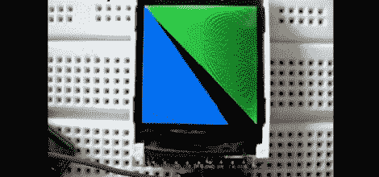

# Arduino 与 TFT LCD 的接口

> 原文：<https://hackaday.com/2011/02/21/interfacing-an-arduino-with-a-tft-lcd/>

七段显示器和单色液晶显示器对大多数项目来说都很好，但有些东西彩色看起来更好。小鸟电子博客的[John]最近写了一篇教程[，演示如何使用带有 Arduino](http://blog.littlebirdelectronics.com/tutorial-arduino-and-tft-lcd) 的 TFT LCD 面板。他选择的特定面板是 4D 系统公司的 1.44 英寸 TFT LCD，碰巧配备了专用的图形处理器，当充分发挥其潜力时，应该可以实现一些奇妙的视觉效果。

LCD 通过串行接口接收命令，使其成为项目的简单五线显示解决方案。显示器可以通过串行接口发送十六进制命令进行手动编程，但也有一些用户开发的库，允许您使用大多数最流行的功能，而无需学习曲线。需要注意的一点是，在 LCD 可以通过串行接口进行通信之前，它必须刷新特定版本的固件，这个过程由[John]提供。

LCD 面板可以与任何 Arduino 兼容的板一起使用，因此它可以在许多项目中使用。

留下来看看正在使用的板的简单演示。

 <https://www.youtube.com/embed/BKy-GuKWGZ8?version=3&rel=1&showsearch=0&showinfo=1&iv_load_policy=1&fs=1&hl=en-US&autohide=2&wmode=transparent>

 </body> </html>